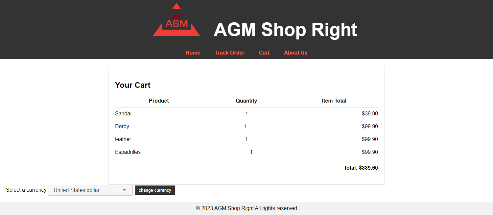

## Credits
Anand Patel

Matthew Trucco

Malka Greenberg

# AGM_Shop_Right

## Description 
Welcome to the AGM Shop Right.Founded in 2023 by a Anand,Malka and Matthew . This   websites  aims to provides  a convenient and  user friendly design for customer to browse and purchase a wide range of stylish and comfortable shoes, jacket, bracelet ,etc.  An  AGM Shop Right ecommerce website where customers can choose products to add to their cart and view their shopping cart. 

## Table of Contents

- [AGM\_Shop\_Right](#agm_shop_right)
  - [Description](#description)
  - [Table of Contents](#table-of-contents)
  - [Technology used](#technology-used)
  - [Features](#features)
  - [Installation](#installation)
  - [Usage](#usage)
  - [Credits](#credits-1)
  - [view concept](#view-concept)
  - [License](#license)

## Technology used 

* Html 
* CSS
* JavaScript
* Jquery and JSON 
  
  
## Features 
*  Customer can browse a wide variety  of shoes and cloth categories.
*  View product details such as images, descriptions and prices.
*   Users can add products to the cart and see the total price. 
*  Regardless of your location, product prices automatically adjust to the local currency .
* Responsive web design for optimal viewing across any devices. 
  

## Installation

For doing this challenges , first i install the VS Code developer tool to edit and modify the starter code. 

## Usage

   
1. clone the AGM_Ecommerce_Shoes repository to your local machine.
2. Open the "index.html" file in your browser. 
3. The customer chooses items to add to his cart. 
4. When the cart button, in the navbar, is clicked the customer is taken to their shopping cart, where they can view the items in their cart with a total price calculated.
5. The customer then has the option to change the quantity of the products in the cart. Or to delete a product from the cart. 
6. The customer then has the option to change the currency, after choosing a currency the prices of each product, as well as the total price will be adjusted accordingly.
 7. here is demo of app : 
 8. 

## Credits
* We used this API to display the products in our store websites.: [https://fakestoreapi.com/docs]
*  We used this API to currency conversion. [https://currencylayer.com/]
* We  watched this video for push the code from vs code to git hub and deployed at live .[https://www.youtube.com/watch?v=Ky_aUrzArt4]
* In this website , its very helpful to understand how to make a javascript click event listener .[https://developer.mozilla.org/en-US/docs/Web/API/Element/click_event]

* in this website, We  learned a how to fetch the data.[https://developer.mozilla.org/en-US/docs/Web/API/Fetch_API/Using_Fetch] 
 
 ## view concept 
 
 Deployed the application from here:[https://anandp95.github.io/AGM_Ecommerce_Shoes/]
 
## License
N/A